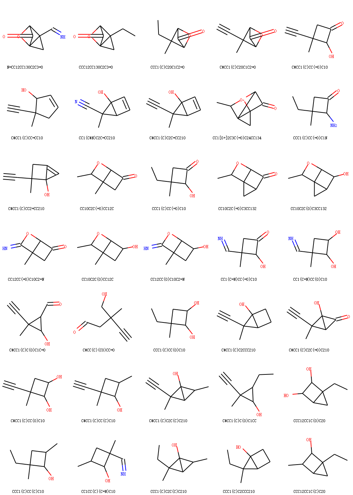
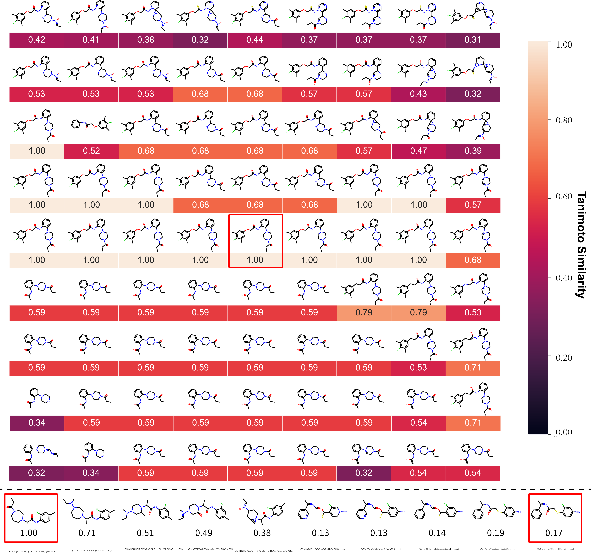
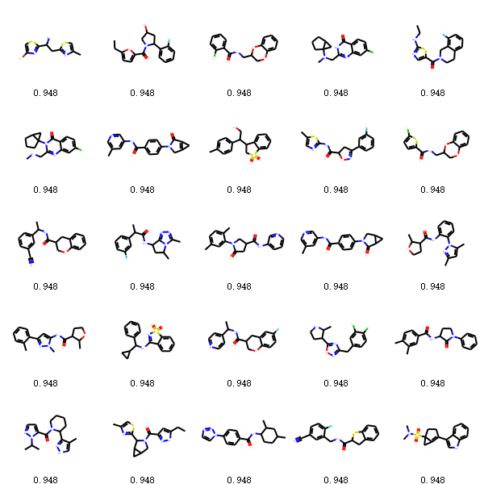
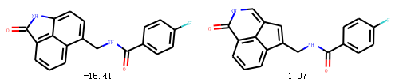

# Open-Omics-Moflow

Open-Omics-MoFlow is a streamlined and optimized version of the MoFlow toolkit, designed to harness the full potential of modern CPUs. It enhances usability through Docker integration and boosts performance with the latest software packages.

## Building the Docker Image
## 🛠️ Building the Docker Image
Run the following command to build the Docker image:

```bash
docker build -t moflow .
```
### 🌐 Building Behind a Proxy
If you're working in a corporate or institutional environment, your internet access may be routed through a proxy server. In such cases, Docker may not be able to download dependencies during the build process unless you explicitly configure proxy settings.

To build the Docker image with proxy settings, you can use the --build-arg option to pass your proxy configuration:

```bash
docker build --build-arg http_proxy=$http_proxy --build-arg https_proxy=$https_proxy --build-arg no_proxy=$no_proxy -t moflow .
```
🔒 Note: Make sure the environment variables http_proxy, https_proxy, and no_proxy are correctly set in your shell before running this command.

For more details, refer to the official Docker documentation:
[Docker behind proxy](https://docs.docker.com/engine/cli/proxy/)

## Setting Up Environment Variables and Directories
To ensure the application runs smoothly, set up the necessary directories and environment variables. Follow these steps:
### Step 1: Export Environment Variables  
Define environment variables for your folder paths. Replace `<your output folder>`, `<your Model folder>`, and `<your Data Preprocessing folder>` with the desired paths:
```bash
export OUTPUT=$PWD/<your output folder>
export MODELS=$PWD/<your Model folder>
export DATA_PREPROCESSING=$PWD/<your Data Preprocessing folder>
```
### Step 2: Create the Required Directories
Here’s an example using standardized folder names. These commands will create the directories, set the environment variables, and adjust permissions:

```bash
mkdir -p output models data_preprocessing
export OUTPUT=$PWD/output     
export MODELS=$PWD/models 
export DATA_PREPROCESSING=$PWD/data_preprocessing
chmod a+w $MODELS $OUTPUT $DATA_PREPROCESSING
```
## Workflow Overview: Data Preprocessing, Model Training, and Experiments
This section outlines the key steps for using the toolkit, including data preprocessing, model training, and running experiments.
### 1. Data Preprocessing
To generate molecular graphs from SMILES strings

qm9
```bash
#example
docker run -it \
  -v $MODELS:/results \
  -v $DATA_PREPROCESSING:/data_preprocessing \
  moflow:latest bash -c \
  "cd data &&  python data_preprocess.py --data_name qm9 --data_dir /data_preprocessing"
```
zinc250k
```bash
docker run -it \
  -v $MODELS:/results \
  -v $DATA_PREPROCESSING:/data_preprocessing \
  moflow:latest bash -c \
  "cd data &&  python data_preprocess.py --data_name zinc250k --data_dir /data_preprocessing"
```
<br />

### 2. Model Training
You can train the model by following the instructions provided in the original MoFlow documentation below.

Alternatively, you can skip training and use a pre-trained model. Download the pre-trained model from the following link:

```
https://drive.google.com/drive/folders/1runxQnF3K_VzzJeWQZUH8VRazAGjZFNF 
```
After downloading, unzip the pre-trained model file and move it to the `$MODELS` directory.

```
mv <downloaded_model_file> $MODELS/
```
### 3. Experiments

#### 3.1-Experiment: reconstruction  
##### To reconstruct QM9 dataset:

```bash
#example
docker run -it \
-v $MODELS:/results \
-v $DATA_PREPROCESSING:/data_preprocessing \
-v $OUTPUT:/output \
moflow:latest bash -c \
  "cd mflow && python generate.py --model_dir /results/qm9_64gnn_128-64lin_1-1mask_0d6noise_convlu1 -snapshot model_snapshot_epoch_200 --data_name qm9 --data_dir /data_preprocessing  --hyperparams-path moflow-params.json --batch-size 256 --reconstruct  2>&1 | tee /output/qm9_reconstruct_results.txt"
```

##### To reconstruct zinc250k dataset:
```bash
#example
docker run -it \
-v $MODELS:/results \
-v $DATA_PREPROCESSING:/data_preprocessing \
-v $OUTPUT:/output \
moflow:latest bash -c \
"cd mflow && python generate.py --model_dir /results/zinc250k_512t2cnn_256gnn_512-64lin_10flow_19fold_convlu2_38af-1-1mask  -snapshot model_snapshot_epoch_200  --data_name zinc250k --data_dir /data_preprocessing --hyperparams-path moflow-params.json --batch-size 256  --reconstruct   2>&1 | tee /output/zinc250k_reconstruct_results.txt"
```

#### 3.2-Experiment: Random generation  

##### Random Generation from sampling from latent space, QM9 model
10000 samples * 5 times:
```bash
#example
docker run -it \
-v $MODELS:/results \
-v $DATA_PREPROCESSING:/data_preprocessing \
-v $OUTPUT:/output \
moflow:latest bash -c \
"cd mflow && python generate.py --model_dir /results/qm9_64gnn_128-64lin_1-1mask_0d6noise_convlu1 -snapshot model_snapshot_epoch_200  --data_name qm9 --data_dir /data_preprocessing --hyperparams-path moflow-params.json --batch-size 10000 --temperature 0.85 --delta 0.05 --n_experiments 5 --save_fig false --correct_validity true 2>&1 | tee /output/qm9_random_generation.log"
```


##### Random Generation from sampling from latent space, zinc250k model
10000 samples * 5 times:
```bash
#example
docker run -it \
-v $MODELS:/results \
-v $DATA_PREPROCESSING:/data_preprocessing \
-v $OUTPUT:/output \
moflow:latest bash -c \
"cd mflow && python generate.py --model_dir /results/zinc250k_512t2cnn_256gnn_512-64lin_10flow_19fold_convlu2_38af-1-1mask  -snapshot model_snapshot_epoch_200 --data_name zinc250k  --data_dir /data_preprocessing --hyperparams-path moflow-params.json   --temperature 0.85  --batch-size 10000 --n_experiments 5  --save_fig false --correct_validity true 2>&1 | tee /output/zinc250k_random_generation.log"
```


#### 3.3-Experiment: Interpolation generation & visualization

##### Interpolation in the latent space, QM9 model
interpolation between 2 molecules (molecular graphs)
```bash
#example
docker run -it \
-v $MODELS:/results \
-v $DATA_PREPROCESSING:/data_preprocessing \
-v $OUTPUT:/output \
moflow:latest bash -c \
"cd mflow && python generate.py --model_dir /results/qm9_64gnn_128-64lin_1-1mask_0d6noise_convlu1 -snapshot model_snapshot_epoch_200 --data_name qm9 --data_dir /data_preprocessing   --hyperparams-path moflow-params.json --batch-size 1000  --temperature 0.65   --int2point --inter_times 50  --correct_validity true 2>&1 | tee /output/qm9_visualization_int2point.log"
```
interpolation in a grid of molecules (molecular graphs)
```bash
#example
docker run -it \
-v $MODELS:/results \
-v $DATA_PREPROCESSING:/data_preprocessing \
-v $OUTPUT:/output \
moflow:latest bash -c \
"cd mflow && python generate.py --model_dir /results/qm9_64gnn_128-64lin_1-1mask_0d6noise_convlu1 -snapshot model_snapshot_epoch_200  --data_name qm9 --data_dir /data_preprocessing  --hyperparams-path moflow-params.json --batch-size 1000  --temperature 0.65 --delta 5  --intgrid  --inter_times 40  --correct_validity true 2>&1 | tee /output/qm9_visualization_intgrid.log"
```

##### Interpolation in the latent space, zinc250k model
interpolation between 2 molecules (molecular graphs)
```bash
#example
docker run -it \
-v $MODELS:/results \
-v $DATA_PREPROCESSING:/data_preprocessing \
-v $OUTPUT:/output \
moflow:latest bash -c \
"cd mflow && python generate.py --model_dir /results/zinc250k_512t2cnn_256gnn_512-64lin_10flow_19fold_convlu2_38af-1-1mask  -snapshot model_snapshot_epoch_200  --data_name zinc250k  --data_dir /data_preprocessing --hyperparams-path moflow-params.json --batch-size 1000  --temperature 0.8 --delta 0.5  --n_experiments 0 --correct_validity true   --int2point  --inter_times 10  2>&1 | tee zinc250k_visualization_int2point.log"
```
interpolation in a grid of molecules (molecular graphs)
```bash
#example
docker run -it \
-v $MODELS:/results \
-v $DATA_PREPROCESSING:/data_preprocessing \
-v $OUTPUT:/output \
moflow:latest bash -c \
"cd mflow && python generate.py --model_dir /results/zinc250k_512t2cnn_256gnn_512-64lin_10flow_19fold_convlu2_38af-1-1mask  -snapshot model_snapshot_epoch_200 --data_name zinc250k --data_dir /data_preprocessing --hyperparams-path moflow-params.json --batch-size 1000  --temperature 0.8 --delta 5  --n_experiments 0 --correct_validity true   --intgrid --inter_times 2  2>&1 | tee /output/zinc250k_visualization_intgrid.log"
```

#### 3.4-Experiment: Molecular optimization & constrained optimization
##### Optimizing zinc250k w.r.t QED property

##### To optimize existing molecules to get novel molecules with optimized QED scores - qm9
```bash
#example
docker run -it \
-v $MODELS:/results \
-v $DATA_PREPROCESSING:/data_preprocessing \
-v $OUTPUT:/output \
moflow:latest bash -c \
"cd mflow && python optimize_property.py -snapshot model_snapshot_epoch_200  --hyperparams_path moflow-params.json --batch_size 256 --model_dir /results/qm9_64gnn_128-64lin_1-1mask_0d6noise_convlu1  --data_name qm9 --data_dir /data_preprocessing --property_name qed --topk 2000  --property_model_path qed_model.pt --debug false  --topscore 2>&1 | tee  /output/qm9_top_qed_optimized.log"
```

##### To optimize existing molecules to get novel molecules with optimized QED scores - zinc250k
```bash
#example
docker run -it \
-v $MODELS:/results \
-v $DATA_PREPROCESSING:/data_preprocessing \
-v $OUTPUT:/output \
moflow:latest bash -c \
"cd mflow && python optimize_property.py -snapshot model_snapshot_epoch_200  --hyperparams_path moflow-params.json --batch_size 256 --model_dir /results/zinc250k_512t2cnn_256gnn_512-64lin_10flow_19fold_convlu2_38af-1-1mask --data_name zinc250k  --data_dir /data_preprocessing  --property_name plogp --topk 800 --property_model_path qed_model.pt   --consopt  --sim_cutoff 0 2>&1 | tee  zinc250k_constrain_optimize_plogp.log"
```
##### Illustrations of molecules with top QED

##### Constrained Optimizing zinc250k w.r.t plogp(or qed) + similarity property
##### To optimize existing molecules to get novel molecules with optimized plogp scores and constrained similarity - qm9
```bash
#example
docker run -it \
-v $MODELS:/results \
-v $DATA_PREPROCESSING:/data_preprocessing \
-v $OUTPUT:/output \
moflow:latest bash -c \
"cd mflow && python optimize_property.py -snapshot model_snapshot_epoch_200  --hyperparams_path moflow-params.json --batch_size 256 --model_dir /results/qm9_64gnn_128-64lin_1-1mask_0d6noise_convlu1  --data_name qm9 --data_dir /data_preprocessing   --property_name plogp --topk 800 --property_model_path qed_model.pt   --consopt  --sim_cutoff 0 2>&1 | tee  /output/qm9_constrain_optimize_plogp.log"
```
##### To optimize existing molecules to get novel molecules with optimized plogp scores and constrained similarity - zinc250k
```bash
#example
docker run -it \
-v $MODELS:/results \
-v $DATA_PREPROCESSING:/data_preprocessing \
-v $OUTPUT:/output \
moflow:latest bash -c \
"cd mflow && python optimize_property.py -snapshot model_snapshot_epoch_200  --hyperparams_path moflow-params.json --batch_size 256 --model_dir /results/zinc250k_512t2cnn_256gnn_512-64lin_10flow_19fold_convlu2_38af-1-1mask --data_name zinc250k  --data_dir /data_preprocessing  --property_name plogp --topk 800 --property_model_path qed_model.pt   --consopt  --sim_cutoff 0 2>&1 | tee  /output/zinc250k_constrain_optimize_plogp.log"
```

---
The original README content of Moflow follows.
#

# moflow

Please refer to our paper:

Zang, Chengxi, and Fei Wang. "MoFlow: an invertible flow model for generating molecular graphs." In Proceedings of the 26th ACM SIGKDD International Conference on Knowledge Discovery & Data Mining, pp. 617-626. 2020.

```
https://arxiv.org/abs/2006.10137
```
```
@inproceedings{zang2020moflow,
  title={MoFlow: an invertible flow model for generating molecular graphs},
  author={Zang, Chengxi and Wang, Fei},
  booktitle={Proceedings of the 26th ACM SIGKDD International Conference on Knowledge Discovery \& Data Mining},
  pages={617--626},
  year={2020}
}
```

## 0. Install Libs:
```
conda create --name moflow python pandas matplotlib    (conda 4.6.7, python 3.8.5, pandas 1.1.2, matplotlib  3.3.2)
conda activate moflow
conda install pytorch torchvision cudatoolkit=10.2 -c pytorch (pytorch 1.6.0, torchvision 0.7.0)
conda install rdkit  (rdkit 2020.03.6)
conda install orderedset  (orderset 2.0.3)
conda install tabulate  (tabulate 0.8.7)
conda install networkx  (networkx 2.5)
conda install scipy  (scipy 1.5.0)
conda install seaborn  (seaborn 0.11.0)
pip install cairosvg (cairosvg 2.4.2)
pip install tqdm  (tqdm 4.50.0)
```
To clone code from this project, say
```
git clone https://github.com/calvin-zcx/moflow.git moflow
```
## 1. Data Preprocessing
To generate molecular graphs from SMILES strings
```
cd data
python data_preprocess.py --data_name qm9
python data_preprocess.py --data_name zinc250k
```

## 2. Model Training
#### Training model for QM9 dataset:
```
cd mflow
python train_model.py --data_name qm9  --batch_size 256  --max_epochs 200 --gpu 0  --debug True  --save_dir=results/qm9_64gnn_128-64lin_1-1mask_0d6noise_convlu1  --b_n_flow 10  --b_hidden_ch 128,128  --a_n_flow 27 --a_hidden_gnn 64  --a_hidden_lin 128,64  --mask_row_size_list 1 --mask_row_stride_list 1 --noise_scale 0.6 --b_conv_lu 1  2>&1 | tee qm9_64gnn_128-64lin_1-1mask_0d6noise_convlu1.log
```
#### Training model for zinc250k dataset:
```
cd mflow
python train_model.py  --data_name zinc250k  --batch_size  256  --max_epochs 200 --gpu 0  --debug True  --save_dir=results/zinc250k_512t2cnn_256gnn_512-64lin_10flow_19fold_convlu2_38af-1-1mask   --b_n_flow 10  --b_hidden_ch 512,512  --a_n_flow 38  --a_hidden_gnn 256  --a_hidden_lin  512,64   --mask_row_size_list 1 --mask_row_stride_list 1  --noise_scale 0.6  --b_conv_lu 2  2>&1 | tee zinc250k_512t2cnn_256gnn_512-64lin_10flow_19fold_convlu2_38af-1-1mask.log
```
#### Or downloading and  using our trained models in 
```
https://drive.google.com/drive/folders/1runxQnF3K_VzzJeWQZUH8VRazAGjZFNF 
```

## 3. Model Testing

### 3.1-Experiment: reconstruction  
#### To reconstruct QM9 dataset:
```
cd mflow
python generate.py --model_dir results/qm9_64gnn_128-64lin_1-1mask_0d6noise_convlu1 -snapshot model_snapshot_epoch_200 --gpu 0 --data_name qm9  --hyperparams-path moflow-params.json --batch-size 256 --reconstruct  2>&1 | tee qm9_reconstruct_results.txt
```

```
### Results
Tips:  results can be printed & dumped to a .txt file by  "2>&1 | tee qm9_reconstruct_results.txt"
133885 in total, 120803  training data, 13082  testing data, 256 batchsize, train/batchsize 471.88671875
...
iter/total: 468/472, reconstruction_rate:1.0
iter/total: 469/472, reconstruction_rate:1.0
iter/total: 470/472, reconstruction_rate:1.0
iter/total: 471/472, reconstruction_rate:1.0
reconstruction_rate for all the train data:1.0 in 120803
Invertible model! 100% reconstruction!
```


#### To reconstruct zinc250k dataset:
```
cd mflow
python generate.py --model_dir results/zinc250k_512t2cnn_256gnn_512-64lin_10flow_19fold_convlu2_38af-1-1mask  -snapshot model_snapshot_epoch_200 --gpu  0  --data_name zinc250k --hyperparams-path moflow-params.json --batch-size 256  --reconstruct   2>&1 | tee zinc250k_reconstruct_results.txt
```
##### Results:
```
249455 in total, 224568  training data, 24887  testing data, 256 batchsize, train/batchsize 877.21875
...
iter/total: 877/878, reconstruction_rate:1.0
reconstruction_rate for all the train data:1.0 in 224568
Invertible model! 100% reconstruction!
```

### 3.2-Experiment: Random generation  

#### Random Generation from sampling from latent space, QM9 model
10000 samples * 5 times:
```
python generate.py --model_dir results/qm9_64gnn_128-64lin_1-1mask_0d6noise_convlu1 -snapshot model_snapshot_epoch_200 --gpu 0 --data_name qm9 --hyperparams-path moflow-params.json --batch-size 10000 --temperature 0.85 --delta 0.05 --n_experiments 5 --save_fig false --correct_validity true 2>&1 | tee qm9_random_generation.log
```
#####  Results
```
validity: mean=100.00%, sd=0.00%, vals=[100.0, 100.0, 100.0, 100.0, 100.0]
novelty: mean=98.05%, sd=0.12%, vals=[98.07731024763439, 98.11472930738985, 97.88434414668548, 97.95239055880573, 98.21877830331086]
uniqueness: mean=99.26%, sd=0.09%, vals=[99.33999999999999, 99.19, 99.26, 99.14, 99.37]
abs_novelty: mean=97.32%, sd=0.18%, vals=[97.43, 97.32, 97.16, 97.11, 97.6]
abs_uniqueness: mean=99.26%, sd=0.09%, vals=[99.33999999999999, 99.19, 99.26, 99.14, 99.37]
Task random generation done! Time 185.09 seconds, Data: Tue Sep 29 11:20:15 2020
# Above is just one random result. Tuning:
    --batch-size for the number of  mols to be generated
    --temperature for different generation results, 
    --correct_validity false for results without correction
    --save_fig true for figures of generated mols, set batch-size a resoanble number for dump figures 
# more details see parameter configuration in generate.py
# Output details are in qm9_random_generation.log
```

#### Random Generation from sampling from latent space, zinc250k model
10000 samples * 5 times:
```
python generate.py --model_dir results/zinc250k_512t2cnn_256gnn_512-64lin_10flow_19fold_convlu2_38af-1-1mask  -snapshot model_snapshot_epoch_200 --gpu  0  --data_name zinc250k --hyperparams-path moflow-params.json   --temperature 0.85  --batch-size 10000 --n_experiments 5  --save_fig false --correct_validity true 2>&1 | tee zinc250k_random_generation.log
```
#####  Results
```
validity: mean=100.00%, sd=0.00%, vals=[100.0, 100.0, 99.99, 100.0, 100.0]
novelty: mean=100.00%, sd=0.00%, vals=[100.0, 100.0, 100.0, 100.0, 100.0]
uniqueness: mean=99.99%, sd=0.01%, vals=[100.0, 99.98, 100.0, 99.99, 99.99]
abs_novelty: mean=99.99%, sd=0.01%, vals=[100.0, 99.98, 99.99, 99.99, 99.99]
abs_uniqueness: mean=99.99%, sd=0.01%, vals=[100.0, 99.98, 99.99, 99.99, 99.99]
Task1 random generation done! Time 537.13 seconds, Data: Tue Sep 29 11:36:12 2020
# Above is just one random result. Tuning:
    --batch-size for the number of  mols to be generated
    --temperature for different generation results, 
    --correct_validity false for results without correction
    --save_fig true for figures of generated mols, set batch-size a resoanble number for dump figures 
# more details see parameter configuration in generate.py
# Output details are in qm9_random_generation.log
```

### 3.3-Experiment: Interpolation generation & visualization

#### Interpolation in the latent space, QM9 model
interpolation between 2 molecules (molecular graphs)
```
python generate.py --model_dir results/qm9_64gnn_128-64lin_1-1mask_0d6noise_convlu1 -snapshot model_snapshot_epoch_200 --gpu 0 --data_name qm9  --hyperparams-path moflow-params.json --batch-size 1000  --temperature 0.65   --int2point --inter_times 50  --correct_validity true 2>&1 | tee qm9_visualization_int2point.log
```
interpolation in a grid of molecules (molecular graphs)
```
python generate.py --model_dir results/qm9_64gnn_128-64lin_1-1mask_0d6noise_convlu1 -snapshot model_snapshot_epoch_200 --gpu 0 --data_name qm9  --hyperparams-path moflow-params.json --batch-size 1000  --temperature 0.65 --delta 5  --intgrid  --inter_times 40  --correct_validity true 2>&1 | tee tee qm9_visualization_intgrid.log
```

#### Interpolation in the latent space, zinc250k model
interpolation between 2 molecules (molecular graphs)
```
python generate.py --model_dir results/zinc250k_512t2cnn_256gnn_512-64lin_10flow_19fold_convlu2_38af-1-1mask  -snapshot model_snapshot_epoch_200 --gpu  0  --data_name zinc250k --hyperparams-path moflow-params.json --batch-size 1000  --temperature 0.8 --delta 0.5  --n_experiments 0 --correct_validity true   --int2point  --inter_times 10  2>&1 | tee zinc250k_visualization_int2point.log
```
interpolation in a grid of molecules (molecular graphs)
```
python generate.py --model_dir results/zinc250k_512t2cnn_256gnn_512-64lin_10flow_19fold_convlu2_38af-1-1mask  -snapshot model_snapshot_epoch_200 --gpu  0  --data_name zinc250k --hyperparams-path moflow-params.json --batch-size 1000  --temperature 0.8 --delta 5  --n_experiments 0 --correct_validity true   --intgrid --inter_times 2  2>&1 | tee zinc250k_visualization_intgrid.log
```
#### Some illustrations





### 3.4-Experiment: Molecular optimization & constrained optimization
#### Optimizing zinc250k w.r.t QED property
#### Training an additional MLP from latent space to QED property
```
python optimize_property.py -snapshot model_snapshot_epoch_200  --hyperparams_path moflow-params.json --batch_size 256 --model_dir results/zinc250k_512t2cnn_256gnn_512-64lin_10flow_19fold_convlu2_38af-1-1mask   --gpu 0 --max_epochs 3  --weight_decay 1e-3  --data_name zinc250k  --hidden 16,  --temperature 1.0  --property_name qed 2>&1 | tee  training_optimize_zinc250k_qed.log
# Output: a molecular property prediction model for optimization, say named as qed_model.pt
# e.g. saving qed regression model to: results/zinc250k_512t2cnn_256gnn_512-64lin_10flow_19fold_convlu2_38af-1-1mask/qed_model.pt
# Train and save model done! Time 477.87 seconds 
# Can tune:
#         --max_epochs 3  
#         --weight_decay 1e-3  
#         --hidden 16
# etc.
```
#### Or downloading and  using our trained models in 
```
https://drive.google.com/drive/folders/1runxQnF3K_VzzJeWQZUH8VRazAGjZFNF 
```
#### To optimize existing molecules to get novel molecules with optimized QED scores
```
python optimize_property.py -snapshot model_snapshot_epoch_200  --hyperparams_path moflow-params.json --batch_size 256 --model_dir results/zinc250k_512t2cnn_256gnn_512-64lin_10flow_19fold_convlu2_38af-1-1mask   --gpu 0   --data_name zinc250k   --property_name qed --topk 2000  --property_model_path qed_model.pt --debug false  --topscore 2>&1 | tee  zinc250k_top_qed_optimized.log
# Input: --property_model_path qed_model.pt is the regression model
# Output: dump a ranked list of generated optimized and novel molecules w.r.t qed
```
#### Illustrations of molecules with top QED


#### Constrained Optimizing zinc250k w.r.t plogp(or qed) + similarity property
#### to train an additional MLP from latent space to plogp property
```
python optimize_property.py -snapshot model_snapshot_epoch_200  --hyperparams_path moflow-params.json --batch_size 256 --model_dir results/zinc250k_512t2cnn_256gnn_512-64lin_10flow_19fold_convlu2_38af-1-1mask   --gpu 0  --max_epochs 3  --weight_decay 1e-2  --data_name zinc250k  --hidden 16,  --temperature 1.0  --property_name plogp 2>&1 | tee training_optimize_zinc250k_plogp.log
# Output: a molecular property prediction model for optimization, say named as plogp_model.pt
# e.g. saving plogp  regression model to: results/zinc250k_512t2cnn_256gnn_512-64lin_10flow_19fold_convlu2_38af-1-1mask/plogp_model.pt
# Train and save model done! Time 473.74 seconds
# Can tune:
#         --max_epochs 3  
#         --weight_decay 1e-2  
#        --hidden 16
#etc.
```
#### To optimize existing molecules to get novel molecules with optimized plogp scores and constrained similarity
```
python optimize_property.py -snapshot model_snapshot_epoch_200  --hyperparams_path moflow-params.json --batch_size 256 --model_dir results/zinc250k_512t2cnn_256gnn_512-64lin_10flow_19fold_convlu2_38af-1-1mask   --gpu 0    --data_name zinc250k    --property_name plogp --topk 800 --property_model_path qed_model.pt   --consopt  --sim_cutoff 0 2>&1 | tee  zinc250k_constrain_optimize_plogp.log
# Input: --property_model_path qed_model.pt or plogp_model.pt is the regression model
         --sim_cutoff 0 (or 0.2, 0.4 etc for similarity)
         --topk 800 (choose first 800 molecules with worset property values for improving)
# Output: 
# Using qed_model.pt for optimizing plogp with 
# Because qed and plogp have some correlations, here we use both qed/plogp model for 2 optimization tasks
# --sim_cutoff 0:
#   similarity: 0.300610 +/- 0.201674 
#   Improvement:  8.612461 +/- 5.436995
#   success rate: 0.98875
# --sim_cutoff 0.2:
#   similarity:  0.434700 +/-  0.196490 
#   Improvement:  7.057115 +/-  5.041250
#   success rate: 0.9675
# --sim_cutoff 0.4:
#   similarity:  0.608440 +/-   0.177670 
#   Improvement:  4.712418 +/-   4.549682
#   success rate: 0.8575
# --sim_cutoff 0.6:
#   similarity:   0.792550 +/- 0.144577   
#   Improvement:   2.095266 +/-   2.858545  
#   success rate:  0.5825

# Using plogp_model.pt for optimizing plogp with 
# --sim_cutoff 0:
#    similarity:  0.260503 +/- 0.195945
#   Improvement:  9.238813 +/-  6.279859
#   success rate: 0.9925
# --sim_cutoff 0.2:
#    similarity:  0.425541 +/- 0.198020
#    Improvement:  7.246221 +/-  5.325543
#    success rate: 0.9575
# --sim_cutoff 0.4:
#    similarity:   0.625976 +/- 0.189293
#    Improvement:  4.504411 +/-  4.712031
#    success rate: 0.8425
# --sim_cutoff 0.6:
#    similarity:   0.810805 +/- 0.146080
#    Improvement:  1.820525 +/-  2.595302
#    success rate: 0.565
```
More configurations please refer to our codes optimize_property.py and the optimization chapter in our paper.
#### One illustration of optimizing plogp



